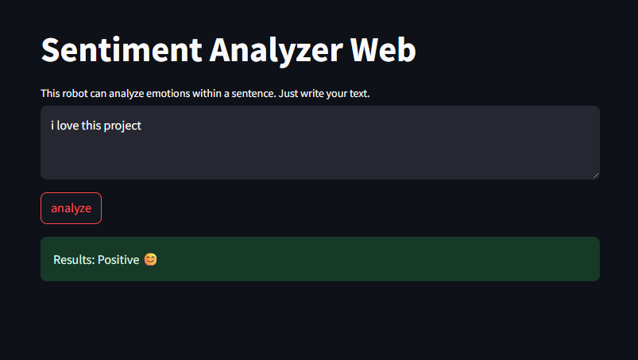

# Sentiment_analysis
A robot that can analyze emotions.

With this web app, you can analyze the sentiment of any text with just one click:
Positive 😊 | Negative 😠 | or Neutral 😐

📌 Built with:
- Python 🐍
- Streamlit for a simple and attractive user interface
- TextBlob for natural language processing (NLP)

This is just the beginning — more cool projects are on the way! 
🔥 If you liked it, don't forget to star ⭐
